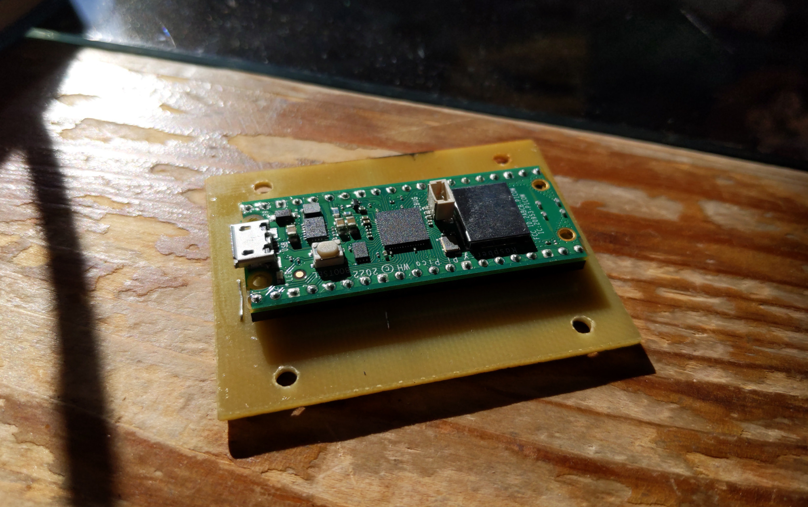
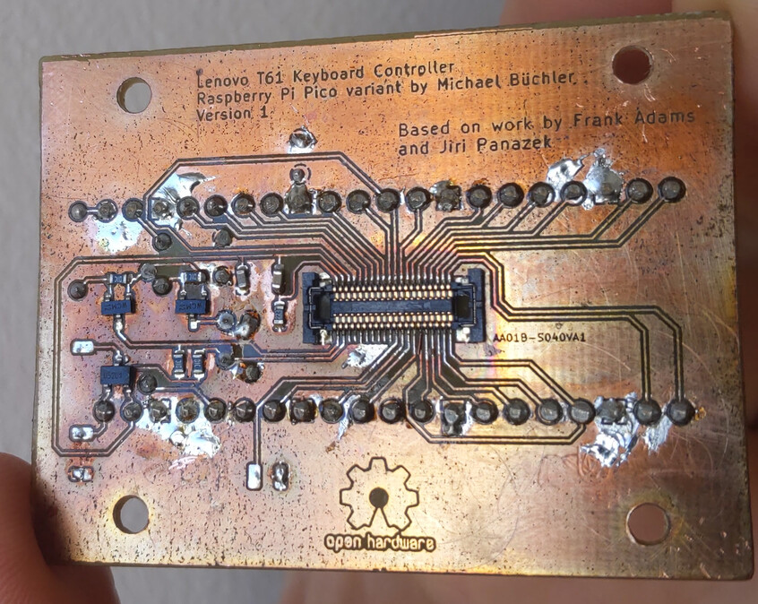
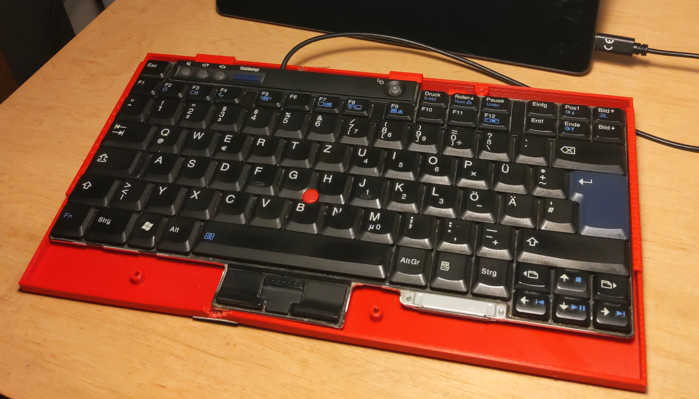

Keyboard scanner for a Thinkpad T61 keyboard, using the original connector,
salvaged from a retired T61, and a Raspberry Pi Pico H. Components on the BOM:

* 1x JAE Electronics AA01B-S040VA1
* 1x Raspberry Pi Pico H (or WH)
* 1x capacitor SMD 0603 2.2 uF
* 1x capacitor SMD 0603 100 nF
* 1x p-MOSFET TSM2305CX or similar (optional, for external 5V, e.g. a battery)
* 2x n-MOSFET 2N7002 or similar
* 4x resistor SMD 0603 10 kOhm
* 1x resistor SMD 0603 22 kOhm

Based on work by thedalles77 (schematics) and WarhawkCZ (QMK variant). HDR also
had the same idea of having the keyboard connector and the MCU module on
opposite sides to save space.
- https://github.com/thedalles77/USB_Laptop_Keyboard_Controller/tree/master/Example_Keyboards/Lenovo_ThinkPad_T61/Teensy%20LC
- https://forum.thinkpads.com/viewtopic.php?t=134293
- https://github.com/HDR/USB_Laptop_Keyboard_Controller

Thanks @tpcware for the KiCad symbol, footprint and 3D model for the Raspberry
Pi Pico. I butchered the footprint to get a THT-only variant.
https://github.com/ncarandini/KiCad-RP-Pico

I'm glad I listened to the advice by thedalles77 on instructables to lay out
the connections on a piece of paper before assigning the nets in the schematic
editor. The thoughtful pinout of the connector was also helpful - thanks,
Lenovo engineers.
https://www.instructables.com/How-to-Make-a-USB-Laptop-Keyboard-Controller/

When using a Pico WH it might be possible to extend this with Bluetooth, hence
the solder pads for wires to an external battery charger + 5V converter.

Single layer because:

* I can make it at home and don't even have to align two layers which would
  increase the effort
* I have single-layered board lying around already
* I want to improve my process and get better with narrow tracks
* I never ordered from a PCB manufacturer so there is a mental barrier

Process:

* make PCB (I use toner transfer and sodium persulfate)
* drill holes
* solder SMD components (I use a home-made reflow oven; deposit some solder on
  the pads, clean with alcohol, put flux gel on pads, place components, bake)
* solder wire bridges (front layer)
* solder Raspberry Pi Pico H
* check everything twice for solder bridges; use lots of flux

## Third-party components

The following components in this repository are not my work:

Symbols:

* AA01B-S040VA1 - probably by Jiri Panacek (WarhawkCZ)

Footprints:

* T61_Kb_Scanner:RPi_Pico_H - adapted from the one by @tpcware
* T61_Kb_Scanner:AA01B-S040VA1 - unknown
* T61_Kb_Scanner:WM6787CT-ND - unknown

## License

Copyright 2023 Michael Büchler
SPDX-License-Identifier: Apache-2.0 WITH SHL-2.1

The schematics and PCB design in this repository shall use the Solderpad Hardware License v 2.1 (the “License”); you may not use this file except in compliance with the License, or, at your option, the Apache License version 2.0. You may obtain a copy of the License at

https://solderpad.org/licenses/SHL-2.1/

Unless required by applicable law or agreed to in writing, any work distributed under the License is distributed on an “AS IS” BASIS, WITHOUT WARRANTIES OR CONDITIONS OF ANY KIND, either express or implied. See the License for the specific language governing permissions and limitations under the License.

## Images

The keyboard case in the picture is this one:
https://www.printables.com/model/877321-thinkpad-t61-keyboard-base

